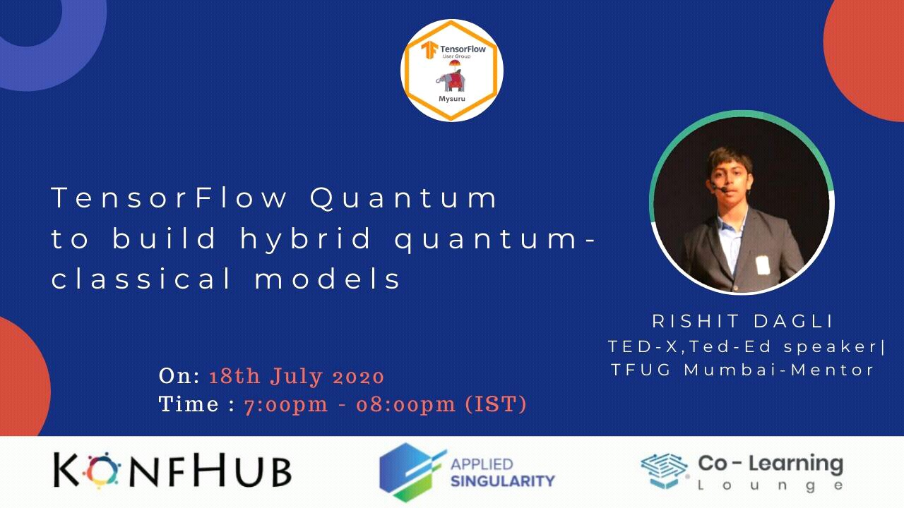

# TFUG-Mysuru-2020 

My session at [TensorFlow User Group Mysuru](https://www.meetup.com/TFUG-Mysuru/) about **TensorFlow Quantum to build hybrid quantum-classical models**, 18 July 2020.

### [Event Announcement](https://www.meetup.com/TFUG-Mysuru/events/271789127/)

### [Slides](http://bit.ly/tfq-slides)

